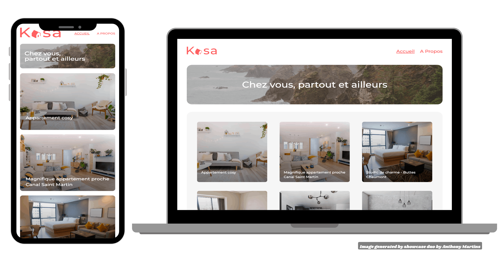

# Kasa - Application web de location immobilière

## Aperçu du projet



## Description du projet

Réalisation dans le cadre de ma formation d'intégrateur web chez OpenClassrooms.<br><br>
Il consiste à développer le front-end d'une application de location immobilière pour Kasa, une entreprise de location d'appartements entre particuliers.<br>
L'application a été développé en utilisant React et React Router, avec des maquettes fournies sur Figma 
([voir la maquette](https://www.figma.com/design/2BZEoBhyxt5IwZgRn0wGsL/Kasa_FR)) et des données simulées extraites d'un fichier JSON.

## Démo en ligne

Vous pouvez consulter le projet [Kasa sur GitHub Pages ](https://martins-anthony.github.io/kasa/).

## Objectifs du projet

- **Initialisation avec create react app** : Démarrer le projet en utilisant create react app pour configurer l'environnement de développement.
- **Routage avec react router** : Configurer la navigation entre les différentes pages de l'application.
- **Développement de composants react** : Créer et structurer les composants de l'interface utilisateur.
- **Utisisation de SASS (SCSS)** : Gérer et organiser les styles CSS en utilisant le préprocesseur SCSS.
- **Mise en oeuvre des animations CSS** : Ajouter des animations pour améliorer l'expérience utilisateur.

## Fonctionnalités clés

- **Navigation multi-pages** : Utilisation de react router pour gérer la navigation entre les pages (accueil, détails du logement, page d'erreur, etc.).
- **Composants réutilisables** : Développement de composants comme la bannière, les cartes de propriété, la galerie d'images avec défilement, et les menus déroulants (Collapses).
- **Gestion des données JSON** : Affichage dynamique des propriétés en utilisant des données JSON simulées.
- **Animation CSS** : Implémentation d'animations pour les éléments interactifs de l'interface (par exemple, l'ouverture et la fermeture des menus déroulants).

## Installation et lancement

pour exécuter ce projet en local, suivez ces étapes :

1. Clonez ce dépôt :
   ```bash
   git clone https://github.com/Martins-Anthony/kasa.git
   ```
2. Accédez au dossier du projet :
   ```bash
    cd kasa
    ```
3. Installez les dépendances nécessaires :
    ```bash
    npm install
    ```
4. Lancez l'application :
    ```bash
    npm start
    ```
5. L'application sera disponible sur `http://localhost:3000`.

## Technologies utilisées

- [](https://react.dev/) : Bibliothèque JavaScript pour construire l'interface utilisateur.
- [](https://reactrouter.com/) : Gestionnaire de routage pour les applications React.
- [](https://sass-lang.com/) : Préprocesseur CSS utilisant la syntaxe SCSS pour structurer et organiser les styles.
- [](https://developer.mozilla.org/en-US/docs/Web/JavaScript) : Pour la logique d'application.
- **[](https://developer.mozilla.org/en-US/docs/Web/HTML) & [](https://developer.mozilla.org/en-US/docs/Web/CSS)** : Pour la structure et le design de l'application.

## Auteur

[](http://webcraft-anthony.com)  [](https://github.com/Martins-Anthony)
